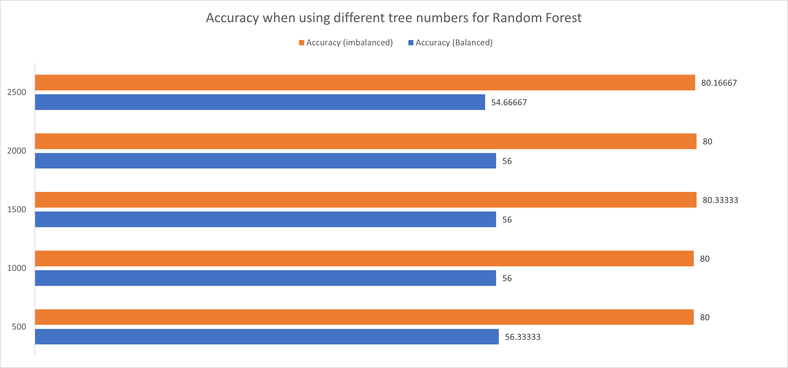

In this file, I tuned the random forest model under the new feature for both imbalanced and balanced training data set. Also I used both ROSE and SMOTE to balance the training data. From the figures above, we can find that when trees = 500 and nodes = 10, the random forest model for balanced data is the best because it has highest AUC and testing accuracy. When **trees = 1500** and **nodes = 30**, the random forest model for imbalanced data is the best for the same reason. We can also find that when tree and node numbers become larger, the accuracy and the AUC might become lower due to the overfitting issue. Therefore, the number that I chose for the random forest model is in the middle of all the possible options.  
If we use SMOTE to balance the data: ntree = 1000, node = 30, mtry = 154 is the best.

Please feel free to set run.ROSE.balance <- TRUE to see the result of using ROSE balanced method, set run.SMOTE.balance <- TRUE to see the result of using SMOTE balanced method, set tune.random.forest <- TRUE to tune the model by yourself, and set test.tune.rf.models <- TRUE to test the tuning result of Random Forest Models.  

The result of tuning process (Balanced with ROSE):  




# Getting all packages
```{r message=FALSE, warning=FALSE}
if(!require("EBImage")){
 install.packages("BiocManager")
 BiocManager::install("EBImage")
}
if(!require("R.matlab")){
  install.packages("R.matlab")
}
if(!require("readxl")){
  install.packages("readxl")
}

if(!require("dplyr")){
  install.packages("dplyr")
}
if(!require("readxl")){
  install.packages("readxl")
}

if(!require("ggplot2")){
  install.packages("ggplot2")
}

if(!require("caret")){
  install.packages("caret")
}

if(!require("glmnet")){
  install.packages("glmnet")
}

if(!require("WeightedROC")){
  install.packages("WeightedROC")
}

if(!require("gbm")){
  install.packages("gbm")
}

if(!require("DMwR")){
  install.packages("DMwR")
}
if(!require("R.matlab")){
  install.packages("R.matlab")
}
if(!require("randomForest")){
 install.packages("randomForest")
}
if(!require("xgboost")){
 install.packages("xgboost")
}
if(!require("tibble")){
 install.packages("tibble")
}
if(!require("ROSE")){
 install.packages("ROSE")
}
if(!require("ggplot2")){
 install.packages("ggplot2")
}
if(!require("tidyverse")){
 install.packages("tidyverse")
}

if(!require("AUC")){
 install.packages("AUC")
}
if(!require("e1071")){
 install.packages("e1071")
}
if(!require("OpenImageR")){
 install.packages("OpenImageR")
}
if(!require("caTools")){
  install.packages("caTools")
}
if(!require("DMwR")){
  install.packages("DMwR")
}
library(R.matlab)
library(readxl)
library(dplyr)
library(EBImage)
library(ggplot2)
library(caret)
library(glmnet)
library(WeightedROC)
library(gbm)
library(DMwR)
library(OpenImageR)
library(AUC)
library(e1071)
library(randomForest)
library(xgboost)
library(tibble)
library(ROSE)
library(ggplot2)
library(tidyverse)
library(AUC)
library(e1071)
library(caTools)
library(R.matlab)
library(DMwR)
```

# All controls you need to adjust
```{r}
run.feature.train <- FALSE # process features for training set
run.feature.test <- FALSE # process features for test set
run.poly.feature <- TRUE # process poly features
run.add.poly.feature <- TRUE # and poly features to dist matrix

# Random Forest Model Tune and and showing the result
# Seeing each Scenario:
run.ROSE.balance <- FALSE # RF model using Balance data of ROSE (when TRUE)
run.SMOTE.balance <- TRUE # RF model using Balance data of SMOTE (when TRUE)
run.imbalanced.rf <- FALSE # RF model using Imbalancd data (when TRUE)

# Tune the model or testing the model?
tune.random.forest <- FALSE # Tune Random Forest Model using imbalanced data 
test.tune.rf.models <- TRUE # Test the tuning result of Random Forest Models using imbalanced data
```

# Setting Data
## Getting raw data ready
```{r}
set.seed(2020)
setwd("../doc")
# All directories for training images:
train_dir <- "../data/train_set/" # This will be modified for different data sets.
train_image_dir <- paste(train_dir, "images/", sep="")
train_pt_dir <- paste(train_dir,  "points/", sep="")
train_label_path <- paste(train_dir, "label.csv", sep="")
```
## Import raw data
```{r}
#train-test split
info <- read.csv(train_label_path)
n <- nrow(info) #get number of rows from csv
n_train <- round(n*(4/5), 0) #use 4/5 amount of data for training
train_idx <- sample(info$Index, n_train, replace = F) #grab indexs used for training
test_idx <- setdiff(info$Index, train_idx) # get indexs not used for training

n_files <- length(list.files(train_image_dir,'*jpg'))
```
## Read Fiducial Points
```{r}
readMat.matrix <- function(index){
     return(round(readMat(paste0(train_pt_dir, sprintf("%04d", index),".mat"))[[1]],0))
}

#load fiducial points
fiducial_pt_list <- lapply(1:n_files, readMat.matrix)
save(fiducial_pt_list, file="../output/fiducial_pt_list.RData")
```
## Getting all features ready
```{r}
source("../lib/feature.R")
tm_feature_train <- NA
if(run.feature.train){
  tm_feature_train <- system.time(dat_train<-feature(fiducial_pt_list,train_idx, run.poly.feature, run.add.poly.feature))
  save(dat_train, file="../output/feature_train_RF.RData")
}else{
  load(file="../output/feature_train_RF.RData")
}
tm_feature_test <- NA
if(run.feature.test){
  tm_feature_test <- system.time(dat_test <- feature(fiducial_pt_list, test_idx, run.poly.feature, run.add.poly.feature))
  save(dat_test, file="../output/feature_test_RF.RData")
}else{
  load(file="../output/feature_test_RF.RData")
}
# transfer label column from factor to numeric

dat_train$label <- as.numeric(dat_train$label)
dat_test$label <- as.numeric(dat_test$label)
```

# If use SMOTE to balance the data
ntree = 500, node = 10, mtry = 308 is the best.
```{r}
source("../lib/random_forest.R")
if(run.SMOTE.balance){
dat_test$label <- as.numeric(dat_test$label)


if(tune.random.forest){
  dat_train$label <- as.factor(dat_train$label)
  dat_train_balanced_SMOTE <- SMOTE(label ~ ., dat_train, perc.over = 100, perc.under=200)
  time.rf.tune <- system.time(rf.tune <- random_forest_tune(dat_train_balanced_SMOTE))
  save(rf.tune, file="../output/rf_tune_SMOTE.RData")
  save(time.rf.tune, file = "../output/rf_tune_time_SMOTE.RData")
}else{
  load("../output/rf_tune_SMOTE.RData")
  load("../output/rf_tune_time_SMOTE.RData")
}
rf.tune
time.rf.tune[1]
plot(rf.tune, main = "Choose best mtry",type = 'l')
# mtry = 154

if(tune.random.forest){
  # Train 500 trees:
  time.rf.train.tree500 <- system.time(random_forest_fit_500_trees <- random_forest_train(dat_train_balanced_SMOTE, mtry = 154, tree_number = 500, node_size = 25))
  save(random_forest_fit_500_trees, file = "../output/rf_train_500_trees_SMOTE.RData")
  save(time.rf.train.tree500, file = "../output/rf_train_500_trees_time_SMOTE.RData")
  cat("500 tree time", time.rf.train.tree500[1])
  # Train 1000 trees:
  time.rf.train.tree1000 <- system.time(random_forest_fit_1000_trees <- random_forest_train(dat_train_balanced_SMOTE, mtry = 154, tree_number = 1000, node_size = 25))
  save(random_forest_fit_1000_trees, file = "../output/rf_train_1000_trees_SMOTE.RData")
  save(time.rf.train.tree1000, file = "../output/rf_train_1000_trees_time_SMOTE.RData")
  cat("1000 tree time", time.rf.train.tree1000[1])
  # Train 1500 trees:
  time.rf.train.tree1500 <- system.time(random_forest_fit_1500_trees <- random_forest_train(dat_train_balanced_SMOTE, mtry = 154, tree_number = 1500, node_size = 25))
  save(random_forest_fit_1500_trees, file = "../output/rf_train_1500_trees_SMOTE.RData")
  save(time.rf.train.tree1500, file = "../output/rf_train_1500_trees_time_SMOTE.RData")
  cat("1500 tree time", time.rf.train.tree1500[1])
# tree = 1000 is the best

  # Train 10 nodes
  time.rf.train.node10 <- system.time(random_forest_fit_10_nodes <- random_forest_train(dat_train_balanced_SMOTE, mtry = 154, tree_number = 1000, node_size = 10))
  save(random_forest_fit_10_nodes, file = "../output/rf_train_10_nodes_SMOTE.RData")
  save(time.rf.train.node10, file = "../output/rf_train_10_nodes_time_SMOTE.RData")
  cat("10 node time", time.rf.train.node10[1])
  # Train 15 nodes
  time.rf.train.node15 <- system.time(random_forest_fit_15_nodes <- random_forest_train(dat_train_balanced_SMOTE, mtry = 154, tree_number = 1000, node_size = 15))
  save(random_forest_fit_15_nodes, file = "../output/rf_train_15_nodes_SMOTE.RData")
  save(time.rf.train.node15, file = "../output/rf_train_15_nodes_time_SMOTE.RData")
  cat("15 node time", time.rf.train.node15[1])
  # Train 20 nodes
  time.rf.train.node20 <- system.time(random_forest_fit_20_nodes <- random_forest_train(dat_train_balanced_SMOTE, mtry = 154, tree_number = 1000, node_size = 20))
  save(random_forest_fit_20_nodes, file = "../output/rf_train_20_nodes_SMOTE.RData")
  save(time.rf.train.node20, file = "../output/rf_train_20_nodes_time_SMOTE.RData")
  cat("20 node time", time.rf.train.node20[1])
  # Train 25 nodes
  time.rf.train.node25 <- system.time(random_forest_fit_25_nodes <- random_forest_train(dat_train_balanced_SMOTE, mtry = 154, tree_number = 1000, node_size = 25))
  save(random_forest_fit_25_nodes, file = "../output/rf_train_25_nodes_SMOTE.RData")
  save(time.rf.train.node25, file = "../output/rf_train_25_nodes_time_SMOTE.RData")
  cat("25 node time", time.rf.train.node25[1])
  # Train 30 nodes
  time.rf.train.node30 <- system.time(random_forest_fit_30_nodes <- random_forest_train(dat_train_balanced_SMOTE, mtry = 154, tree_number = 1000, node_size = 30))
  save(random_forest_fit_30_nodes, file = "../output/rf_train_30_nodes_SMOTE.RData")
  save(time.rf.train.node30, file = "../output/rf_train_30_nodes_time_SMOTE.RData")
  cat("30 node time", time.rf.train.node30[1])
}else{
  load("../output/rf_train_500_trees_SMOTE.RData")
  load("../output/rf_train_1000_trees_SMOTE.RData")
  load("../output/rf_train_1500_trees_SMOTE.RData")

  load("../output/rf_train_10_nodes_SMOTE.RData")
  load("../output/rf_train_15_nodes_SMOTE.RData")
  load("../output/rf_train_20_nodes_SMOTE.RData")
  load("../output/rf_train_25_nodes_SMOTE.RData")
  load("../output/rf_train_30_nodes_SMOTE.RData")
}


if(test.tune.rf.models){
# Evaluate each hyperparameter in balanced RF
  
# Predicted value from 500 trees' model:
rf_predicted_balanced <- as.numeric(as.vector(random_forest_test(random_forest_fit_500_trees, dat_test)))
# Evaluate 500 trees:
rf_accuracy_balanced <- mean(round(rf_predicted_balanced == dat_test$label))
tpr.fpr.balanced <- WeightedROC(as.numeric(rf_predicted_balanced),dat_test$label)
rf_AUC_balanced <- WeightedAUC(tpr.fpr.balanced)

cat("Accuracy(balanced) 500", rf_accuracy_balanced*100,"%.\n")
cat("AUC(balanced) 500", rf_AUC_balanced,".\n")

cat("   ","\n")

# Evaluation from 1000 trees' model:
rf_predicted_balanced <- as.numeric(as.vector(random_forest_test(random_forest_fit_1000_trees, dat_test)))

rf_accuracy_balanced <- mean(round(rf_predicted_balanced == dat_test$label))
tpr.fpr.balanced <- WeightedROC(as.numeric(rf_predicted_balanced),dat_test$label)
rf_AUC_balanced <- WeightedAUC(tpr.fpr.balanced)

cat("Accuracy(balanced) 1000", rf_accuracy_balanced*100,"%.\n")
cat("AUC(balanced) 1000", rf_AUC_balanced,".\n")
cat("   ","\n")

# 1500 trees
rf_predicted_balanced <- as.numeric(as.vector(random_forest_test(random_forest_fit_1500_trees, dat_test)))
rf_accuracy_balanced <- mean(round(rf_predicted_balanced == dat_test$label))
tpr.fpr.balanced <- WeightedROC(as.numeric(rf_predicted_balanced),dat_test$label)
rf_AUC_balanced <- WeightedAUC(tpr.fpr.balanced)


cat("Accuracy(balanced) 1500", rf_accuracy_balanced*100,"%.\n")
cat("AUC(balanced) 1500", rf_AUC_balanced,".\n")
cat("   ","\n")

# 10 nodes
rf_predicted_balanced <- as.numeric(as.vector(random_forest_test(random_forest_fit_10_nodes, dat_test)))

rf_accuracy_balanced <- mean(round(rf_predicted_balanced == dat_test$label))
tpr.fpr.balanced <- WeightedROC(as.numeric(rf_predicted_balanced),dat_test$label)
rf_AUC_balanced <- WeightedAUC(tpr.fpr.balanced)


cat("Accuracy(balanced) 10", rf_accuracy_balanced*100,"%.\n")
cat("AUC(balanced) 10", rf_AUC_balanced,".\n")

cat("   ","\n")
# 15 nodes
rf_predicted_balanced <- as.numeric(as.vector(random_forest_test(random_forest_fit_15_nodes, dat_test)))

rf_accuracy_balanced <- mean(round(rf_predicted_balanced == dat_test$label))
tpr.fpr.balanced <- WeightedROC(as.numeric(rf_predicted_balanced),dat_test$label)
rf_AUC_balanced <- WeightedAUC(tpr.fpr.balanced)


cat("Accuracy(balanced) 15", rf_accuracy_balanced*100,"%.\n")
cat("AUC(balanced) 15", rf_AUC_balanced,".\n")
cat("   ","\n")
# 20 nodes
rf_predicted_balanced <- as.numeric(as.vector(random_forest_test(random_forest_fit_20_nodes, dat_test)))

rf_accuracy_balanced <- mean(round(rf_predicted_balanced == dat_test$label))
tpr.fpr.balanced <- WeightedROC(as.numeric(rf_predicted_balanced),dat_test$label)
rf_AUC_balanced <- WeightedAUC(tpr.fpr.balanced)

cat("Accuracy(balanced) 20", rf_accuracy_balanced*100,"%.\n")
cat("AUC(balanced) 20", rf_AUC_balanced,".\n")
cat("   ","\n")
# 25 nodes
rf_predicted_balanced <- as.numeric(as.vector(random_forest_test(random_forest_fit_25_nodes, dat_test)))
rf_accuracy_balanced <- mean(round(rf_predicted_balanced == dat_test$label))
tpr.fpr.balanced <- WeightedROC(as.numeric(rf_predicted_balanced),dat_test$label)
rf_AUC_balanced <- WeightedAUC(tpr.fpr.balanced)

cat("Accuracy(balanced) 25", rf_accuracy_balanced*100,"%.\n")
cat("AUC(balanced) 25", rf_AUC_balanced,".\n")
cat("   ","\n")
# 30 nodes
rf_predicted_balanced <- as.numeric(as.vector(random_forest_test(random_forest_fit_30_nodes, dat_test)))

rf_accuracy_balanced <- mean(round(rf_predicted_balanced == dat_test$label))
tpr.fpr.balanced <- WeightedROC(as.numeric(rf_predicted_balanced),dat_test$label)
rf_AUC_balanced <- WeightedAUC(tpr.fpr.balanced)
cat("Accuracy(balanced) 30", rf_accuracy_balanced*100,"%.\n")
cat("AUC(balanced) 30", rf_AUC_balanced,".\n")
}
}
```

# If use rose to balance the data

```{r}
source("../lib/random_forest.R")

if(run.ROSE.balance){
dat_test <- dat_test

if(tune.random.forest){
  dat_train_balanced_rose<-ROSE(label~., dat_train,seed=2020)$data
  time.rf.tune <- system.time(rf.tune <- random_forest_tune(dat_train_balanced_rose))
  save(rf.tune, file="../output/rf_tune.RData")
  save(time.rf.tune, file = "../output/rf_tune_time.RData")
}else{
  load("../output/rf_tune.RData")
  load("../output/rf_tune_time.RData")
}
rf.tune
time.rf.tune[1]
plot(rf.tune, main = "Choose best mtry",type = 'l')

if(tune.random.forest){
  # Train 500 trees:
  time.rf.train.tree500 <- system.time(random_forest_fit_500_trees <- random_forest_train(dat_train_balanced_rose, mtry = 308, tree_number = 500, node_size = 25))
  save(random_forest_fit_500_trees, file = "../output/rf_train_500_trees.RData")
  save(time.rf.train.tree500, file = "../output/rf_train_500_trees_time.RData")
  cat("500 tree time", time.rf.train.tree500[1])
  # Train 1000 trees:
  time.rf.train.tree1000 <- system.time(random_forest_fit_1000_trees <- random_forest_train(dat_train_balanced_rose, mtry = 308, tree_number = 1000, node_size = 25))
  save(random_forest_fit_1000_trees, file = "../output/rf_train_1000_trees.RData")
  save(time.rf.train.tree1000, file = "../output/rf_train_1000_trees_time.RData")
  cat("1000 tree time", time.rf.train.tree1000[1])
  # Train 1500 trees:
  time.rf.train.tree1500 <- system.time(random_forest_fit_1500_trees <- random_forest_train(dat_train_balanced_rose, mtry = 308, tree_number = 1500, node_size = 25))
  save(random_forest_fit_1500_trees, file = "../output/rf_train_1500_trees.RData")
  save(time.rf.train.tree1500, file = "../output/rf_train_1500_trees_time.RData")
  cat("1500 tree time", time.rf.train.tree1500[1])
  # Train 2000 trees:
  time.rf.train.tree2000 <- system.time(random_forest_fit_2000_trees <- random_forest_train(dat_train_balanced_rose, mtry = 308, tree_number = 2000, node_size = 25))
  save(random_forest_fit_2000_trees, file = "../output/rf_train_2000_trees.RData")
  save(time.rf.train.tree2000, file = "../output/rf_train_2000_trees_time.RData")
  cat("2000 tree time", time.rf.train.tree2000[1])
  # Train 2500 trees:
  time.rf.train.tree2500 <- system.time(random_forest_fit_2500_trees <- random_forest_train(dat_train_balanced_rose, mtry = 308, tree_number = 2500, node_size = 25))
  save(random_forest_fit_2500_trees, file = "../output/rf_train_2500_trees.RData")
  save(time.rf.train.tree2500, file = "../output/rf_train_2500_trees_time.RData")
  cat("2500 tree time", time.rf.train.tree2500[1])

  # Train 10 nodes
  time.rf.train.node10 <- system.time(random_forest_fit_10_nodes <- random_forest_train(dat_train_balanced_rose, mtry = 308, tree_number = 1000, node_size = 10))
  save(random_forest_fit_10_nodes, file = "../output/rf_train_10_nodes.RData")
  save(time.rf.train.node10, file = "../output/rf_train_10_nodes_time.RData")
  cat("10 node time", time.rf.train.node10[1])
  # Train 15 nodes
  time.rf.train.node15 <- system.time(random_forest_fit_15_nodes <- random_forest_train(dat_train_balanced_rose, mtry = 308, tree_number = 1000, node_size = 15))
  save(random_forest_fit_15_nodes, file = "../output/rf_train_15_nodes.RData")
  save(time.rf.train.node15, file = "../output/rf_train_15_nodes_time.RData")
  cat("15 node time", time.rf.train.node15[1])
  # Train 20 nodes
  time.rf.train.node20 <- system.time(random_forest_fit_20_nodes <- random_forest_train(dat_train_balanced_rose, mtry = 308, tree_number = 1000, node_size = 20))
  save(random_forest_fit_20_nodes, file = "../output/rf_train_20_nodes.RData")
  save(time.rf.train.node20, file = "../output/rf_train_20_nodes_time.RData")
  cat("20 node time", time.rf.train.node20[1])
  # Train 25 nodes
  time.rf.train.node25 <- system.time(random_forest_fit_25_nodes <- random_forest_train(dat_train_balanced_rose, mtry = 308, tree_number = 1000, node_size = 25))
  save(random_forest_fit_25_nodes, file = "../output/rf_train_25_nodes.RData")
  save(time.rf.train.node25, file = "../output/rf_train_25_nodes_time.RData")
  cat("25 node time", time.rf.train.node25[1])
  # Train 30 nodes
  time.rf.train.node30 <- system.time(random_forest_fit_30_nodes <- random_forest_train(dat_train_balanced_rose, mtry = 308, tree_number = 1000, node_size = 30))
  save(random_forest_fit_30_nodes, file = "../output/rf_train_30_nodes.RData")
  save(time.rf.train.node30, file = "../output/rf_train_30_nodes_time.RData")
  cat("30 node time", time.rf.train.node30[1])
}else{
  load("../output/rf_train_500_trees.RData")
  load("../output/rf_train_1000_trees.RData")
  load("../output/rf_train_1500_trees.RData")
  load("../output/rf_train_2000_trees.RData")
  load("../output/rf_train_2500_trees.RData")
  load("../output/rf_train_10_nodes.RData")
  load("../output/rf_train_15_nodes.RData")
  load("../output/rf_train_20_nodes.RData")
  load("../output/rf_train_25_nodes.RData")
  load("../output/rf_train_30_nodes.RData")
}


if(test.tune.rf.models){
# Evaluate each hyperparameter in balanced RF

# Predicted value from 500 trees' model:
rf_predicted_balanced <- as.numeric(as.vector(random_forest_test(random_forest_fit_500_trees, dat_test)))
#rf_predicted_imbalanced <- as.numeric(as.vector(random_forest_test(random_forest_fit_500_trees, dat_test)))
# Evaluate 500 trees:
rf_accuracy_balanced <- mean(round(rf_predicted_balanced == dat_test$label))
tpr.fpr.balanced <- WeightedROC(as.numeric(rf_predicted_balanced),dat_test$label)
rf_AUC_balanced <- WeightedAUC(tpr.fpr.balanced)
#rf_accuracy_imbalanced <- mean(round(rf_predicted_imbalanced == dat_test$label))
#tpr.fpr.imbalanced <- WeightedROC(as.numeric(rf_predicted_imbalanced),dat_test$label)
#rf_AUC_imbalanced <- WeightedAUC(tpr.fpr.imbalanced)

cat("Accuracy(balanced) 500", rf_accuracy_balanced*100,"%.\n")
cat("AUC(balanced) 500", rf_AUC_balanced,".\n")
#cat("Accuracy(imbalanced) 500", rf_accuracy_imbalanced*100,"%.\n")
#cat("AUC(imbalanced) 500",rf_AUC_imbalanced,".\n")
cat("   ","\n")

# Evaluation from 1000 trees' model:
rf_predicted_balanced <- as.numeric(as.vector(random_forest_test(random_forest_fit_1000_trees, dat_test)))
#f_predicted_imbalanced <- as.numeric(as.vector(random_forest_test(random_forest_fit_1000_trees, dat_test)))

rf_accuracy_balanced <- mean(round(rf_predicted_balanced == dat_test$label))
tpr.fpr.balanced <- WeightedROC(as.numeric(rf_predicted_balanced),dat_test$label)
rf_AUC_balanced <- WeightedAUC(tpr.fpr.balanced)
# rf_accuracy_imbalanced <- mean(round(rf_predicted_imbalanced == dat_test_balanced_rose$label))
# tpr.fpr.imbalanced <- WeightedROC(as.numeric(rf_predicted_imbalanced),dat_test$label)
# rf_AUC_imbalanced <- WeightedAUC(tpr.fpr.imbalanced)

cat("Accuracy(balanced) 1000", rf_accuracy_balanced*100,"%.\n")
cat("AUC(balanced) 1000", rf_AUC_balanced,".\n")
# cat("Accuracy(imbalanced) 1000", rf_accuracy_imbalanced*100,"%.\n")
# cat("AUC(imbalanced) 1000",rf_AUC_imbalanced,".\n")
cat("   ","\n")
# 1500 trees
rf_predicted_balanced <- as.numeric(as.vector(random_forest_test(random_forest_fit_1500_trees, dat_test)))
# rf_predicted_imbalanced <- as.numeric(as.vector(random_forest_test(random_forest_fit_1500_trees, dat_test)))

rf_accuracy_balanced <- mean(round(rf_predicted_balanced == dat_test$label))
tpr.fpr.balanced <- WeightedROC(as.numeric(rf_predicted_balanced),dat_test$label)
rf_AUC_balanced <- WeightedAUC(tpr.fpr.balanced)
# rf_accuracy_imbalanced <- mean(round(rf_predicted_imbalanced == dat_test_balanced_rose$label))
# tpr.fpr.imbalanced <- WeightedROC(as.numeric(rf_predicted_imbalanced),dat_test$label)
# rf_AUC_imbalanced <- WeightedAUC(tpr.fpr.imbalanced)

cat("Accuracy(balanced) 1500", rf_accuracy_balanced*100,"%.\n")
cat("AUC(balanced) 1500", rf_AUC_balanced,".\n")
# cat("Accuracy(imbalanced) 1500", rf_accuracy_imbalanced*100,"%.\n")
# cat("AUC(imbalanced) 1500",rf_AUC_imbalanced,".\n")
cat("   ","\n")
#2000 trees
#rf_predicted_balanced <- as.numeric(as.vector(random_forest_test(random_forest_fit_2000_trees, dat_test_balanced_rose)))
#rf_predicted_imbalanced <- as.numeric(as.vector(random_forest_test(random_forest_fit_2000_trees, dat_test)))

rf_accuracy_balanced <- mean(round(rf_predicted_balanced == dat_test$label))
tpr.fpr.balanced <- WeightedROC(as.numeric(rf_predicted_balanced),dat_test$label)
rf_AUC_balanced <- WeightedAUC(tpr.fpr.balanced)
# rf_accuracy_imbalanced <- mean(round(rf_predicted_imbalanced == dat_test_balanced_rose$label))
# tpr.fpr.imbalanced <- WeightedROC(as.numeric(rf_predicted_imbalanced),dat_test$label)
# rf_AUC_imbalanced <- WeightedAUC(tpr.fpr.imbalanced)

cat("Accuracy(balanced) 2000", rf_accuracy_balanced*100,"%.\n")
cat("AUC(balanced) 2000", rf_AUC_balanced,".\n")
# cat("Accuracy(imbalanced) 2000", rf_accuracy_imbalanced*100,"%.\n")
# cat("AUC(imbalanced) 2000",rf_AUC_imbalanced,".\n")
cat("   ","\n")
# 2500 trees
rf_predicted_balanced <- as.numeric(as.vector(random_forest_test(random_forest_fit_2500_trees, dat_test)))
# rf_predicted_imbalanced <- as.numeric(as.vector(random_forest_test(random_forest_fit_2500_trees, dat_test)))

rf_accuracy_balanced <- mean(round(rf_predicted_balanced == dat_test$label))
tpr.fpr.balanced <- WeightedROC(as.numeric(rf_predicted_balanced),dat_test$label)
rf_AUC_balanced <- WeightedAUC(tpr.fpr.balanced)
# rf_accuracy_imbalanced <- mean(round(rf_predicted_imbalanced == dat_test_balanced_rose$label))
# tpr.fpr.imbalanced <- WeightedROC(as.numeric(rf_predicted_imbalanced),dat_test$label)
# rf_AUC_imbalanced <- WeightedAUC(tpr.fpr.imbalanced)

cat("Accuracy(balanced) 2500", rf_accuracy_balanced*100,"%.\n")
cat("AUC(balanced) 2500", rf_AUC_balanced,".\n")
# cat("Accuracy(imbalanced) 2500", rf_accuracy_imbalanced*100,"%.\n")
# cat("AUC(imbalanced) 2500",rf_AUC_imbalanced,".\n")
cat("   ","\n")
# 10 nodes
rf_predicted_balanced <- as.numeric(as.vector(random_forest_test(random_forest_fit_10_nodes, dat_test)))
# rf_predicted_imbalanced <- as.numeric(as.vector(random_forest_test(random_forest_fit_10_nodes, dat_test)))

rf_accuracy_balanced <- mean(round(rf_predicted_balanced == dat_test$label))
tpr.fpr.balanced <- WeightedROC(as.numeric(rf_predicted_balanced),dat_test$label)
rf_AUC_balanced <- WeightedAUC(tpr.fpr.balanced)
# rf_accuracy_imbalanced <- mean(round(rf_predicted_imbalanced == dat_test_balanced_rose$label))
# tpr.fpr.imbalanced <- WeightedROC(as.numeric(rf_predicted_imbalanced),dat_test$label)
# rf_AUC_imbalanced <- WeightedAUC(tpr.fpr.imbalanced)

cat("Accuracy(balanced) 10", rf_accuracy_balanced*100,"%.\n")
cat("AUC(balanced) 10", rf_AUC_balanced,".\n")
# cat("Accuracy(imbalanced) 10", rf_accuracy_imbalanced*100,"%.\n")
# cat("AUC(imbalanced) 10",rf_AUC_imbalanced,".\n")
cat("   ","\n")
# 15 nodes
rf_predicted_balanced <- as.numeric(as.vector(random_forest_test(random_forest_fit_15_nodes, dat_test)))
# rf_predicted_imbalanced <- as.numeric(as.vector(random_forest_test(random_forest_fit_15_nodes, dat_test)))

rf_accuracy_balanced <- mean(round(rf_predicted_balanced == dat_test$label))
tpr.fpr.balanced <- WeightedROC(as.numeric(rf_predicted_balanced),dat_test$label)
rf_AUC_balanced <- WeightedAUC(tpr.fpr.balanced)
# rf_accuracy_imbalanced <- mean(round(rf_predicted_imbalanced == dat_test_balanced_rose$label))
# tpr.fpr.imbalanced <- WeightedROC(as.numeric(rf_predicted_imbalanced),dat_test$label)
# rf_AUC_imbalanced <- WeightedAUC(tpr.fpr.imbalanced)

cat("Accuracy(balanced) 15", rf_accuracy_balanced*100,"%.\n")
cat("AUC(balanced) 15", rf_AUC_balanced,".\n")
# cat("Accuracy(imbalanced) 15", rf_accuracy_imbalanced*100,"%.\n")
# cat("AUC(imbalanced) 15",rf_AUC_imbalanced,".\n")
cat("   ","\n")
# 20 nodes
rf_predicted_balanced <- as.numeric(as.vector(random_forest_test(random_forest_fit_20_nodes, dat_test)))
# rf_predicted_imbalanced <- as.numeric(as.vector(random_forest_test(random_forest_fit_20_nodes, dat_test)))

rf_accuracy_balanced <- mean(round(rf_predicted_balanced == dat_test$label))
tpr.fpr.balanced <- WeightedROC(as.numeric(rf_predicted_balanced),dat_test$label)
rf_AUC_balanced <- WeightedAUC(tpr.fpr.balanced)
# rf_accuracy_imbalanced <- mean(round(rf_predicted_imbalanced == dat_test_balanced_rose$label))
# tpr.fpr.imbalanced <- WeightedROC(as.numeric(rf_predicted_imbalanced),dat_test$label)
# rf_AUC_imbalanced <- WeightedAUC(tpr.fpr.imbalanced)

cat("Accuracy(balanced) 20", rf_accuracy_balanced*100,"%.\n")
cat("AUC(balanced) 20", rf_AUC_balanced,".\n")
# cat("Accuracy(imbalanced) 20", rf_accuracy_imbalanced*100,"%.\n")
# cat("AUC(imbalanced) 20",rf_AUC_imbalanced,".\n")
cat("   ","\n")
# 25 nodes
rf_predicted_balanced <- as.numeric(as.vector(random_forest_test(random_forest_fit_25_nodes, dat_test)))
# rf_predicted_imbalanced <- as.numeric(as.vector(random_forest_test(random_forest_fit_25_nodes, dat_test)))

rf_accuracy_balanced <- mean(round(rf_predicted_balanced == dat_test$label))
tpr.fpr.balanced <- WeightedROC(as.numeric(rf_predicted_balanced),dat_test$label)
rf_AUC_balanced <- WeightedAUC(tpr.fpr.balanced)
# rf_accuracy_imbalanced <- mean(round(rf_predicted_imbalanced == dat_test_balanced_rose$label))
# tpr.fpr.imbalanced <- WeightedROC(as.numeric(rf_predicted_imbalanced),dat_test$label)
# rf_AUC_imbalanced <- WeightedAUC(tpr.fpr.imbalanced)

cat("Accuracy(balanced) 25", rf_accuracy_balanced*100,"%.\n")
cat("AUC(balanced) 25", rf_AUC_balanced,".\n")
# cat("Accuracy(imbalanced) 25", rf_accuracy_imbalanced*100,"%.\n")
# cat("AUC(imbalanced) 25",rf_AUC_imbalanced,".\n")
cat("   ","\n")
# 30 nodes
rf_predicted_balanced <- as.numeric(as.vector(random_forest_test(random_forest_fit_30_nodes, dat_test)))
#rf_predicted_imbalanced <- as.numeric(as.vector(random_forest_test(random_forest_fit_30_nodes, dat_test)))

rf_accuracy_balanced <- mean(round(rf_predicted_balanced == dat_test$label))
tpr.fpr.balanced <- WeightedROC(as.numeric(rf_predicted_balanced),dat_test$label)
rf_AUC_balanced <- WeightedAUC(tpr.fpr.balanced)
# rf_accuracy_imbalanced <- mean(round(rf_predicted_imbalanced == dat_test_balanced_rose$label))
# tpr.fpr.imbalanced <- WeightedROC(as.numeric(rf_predicted_imbalanced),dat_test$label)
# rf_AUC_imbalanced <- WeightedAUC(tpr.fpr.imbalanced)

cat("Accuracy(balanced) 30", rf_accuracy_balanced*100,"%.\n")
cat("AUC(balanced) 30", rf_AUC_balanced,".\n")
#cat("Accuracy(imbalanced) 30", rf_accuracy_imbalanced*100,"%.\n")
#cat("AUC(imbalanced) 30",rf_AUC_imbalanced,".\n")
}
}
```

# Tune model from imbalanced data
```{r}
if(run.imbalanced.rf){
source("../lib/random_forest.R")
if(tune.random.forest){
  time.rf.tune <- system.time(rf.tune <- random_forest_tune(dat_train))
  save(rf.tune, file="../output/rf_tune_imbalanced.RData")
  save(time.rf.tune, file = "../output/rf_tune_time_imbalanced.RData")
}else{
  load("../output/rf_tune_imbalanced.RData")
  load("../output/rf_tune_time_imbalanced.RData")
}
if(tune.random.forest){
  # Train 500 trees:
  time.rf.train.tree500 <- system.time(random_forest_fit_500_trees <- random_forest_train(dat_train, mtry = 308, tree_number = 500, node_size = 25))
  save(random_forest_fit_500_trees, file = "../output/rf_train_500_trees_imbalanced.RData")
  save(time.rf.train.tree500, file = "../output/rf_train_500_trees_time_imbalanced.RData")
  cat("500 tree time", time.rf.train.tree500[1])
  # Train 1000 trees:
  time.rf.train.tree1000 <- system.time(random_forest_fit_1000_trees <-  random_forest_train(dat_train, mtry = 308, tree_number = 1000, node_size = 25))
  save(random_forest_fit_1000_trees, file = "../output/rf_train_1000_trees_imbalanced.RData")
  save(time.rf.train.tree1000, file = "../output/rf_train_1000_trees_time_imbalanced.RData")
  cat("1000 tree time", time.rf.train.tree1000[1])
  # Train 1500 trees:
  time.rf.train.tree1500 <- system.time(random_forest_fit_1500_trees <-  random_forest_train(dat_train, mtry = 308, tree_number = 1500, node_size = 25))
  save(random_forest_fit_1500_trees, file = "../output/rf_train_1500_trees_imbalanced.RData")
  save(time.rf.train.tree1500, file = "../output/rf_train_1500_trees_time_imbalanced.RData")
  cat("1500 tree time", time.rf.train.tree1500[1])
  # Train 2000 trees:
  time.rf.train.tree2000 <- system.time(random_forest_fit_2000_trees <-  random_forest_train(dat_train, mtry = 308, tree_number = 2000, node_size = 25))
  save(random_forest_fit_2000_trees, file = "../output/rf_train_2000_trees_imbalanced.RData")
  save(time.rf.train.tree2000, file = "../output/rf_train_2000_trees_time_imbalanced.RData")
  cat("2000 tree time", time.rf.train.tree2000[1])
  # Train 2500 trees:
  time.rf.train.tree2500 <- system.time(random_forest_fit_2500_trees <-  random_forest_train(dat_train, mtry = 308, tree_number = 2500, node_size = 25))
  save(random_forest_fit_2500_trees, file = "../output/rf_train_2500_trees_imbalanced.RData")
  save(time.rf.train.tree2500, file = "../output/rf_train_2500_trees_time_imbalanced.RData")
  cat("2500 tree time", time.rf.train.tree2500[1])

  # Train 10 nodes
  time.rf.train.node10 <- system.time(random_forest_fit_10_nodes <- random_forest_train(dat_train, mtry = 308, tree_number = 1000, node_size = 10))
  save(random_forest_fit_10_nodes, file = "../output/rf_train_10_nodes_imbalanced.RData")
  save(time.rf.train.node10, file = "../output/rf_train_10_nodes_time_imbalanced.RData")
  cat("10 node time", time.rf.train.node10[1])
  # Train 15 nodes
  time.rf.train.node15 <- system.time(random_forest_fit_15_nodes <- random_forest_train(dat_train, mtry = 308, tree_number = 1000, node_size = 15))
  save(random_forest_fit_15_nodes, file = "../output/rf_train_15_nodes_imbalanced.RData")
  save(time.rf.train.node15, file = "../output/rf_train_15_nodes_time_imbalanced.RData")
  cat("15 node time", time.rf.train.node15[1])
  # Train 20 nodes
  time.rf.train.node20 <- system.time(random_forest_fit_20_nodes <- random_forest_train(dat_train, mtry = 308, tree_number = 1000, node_size = 20))
  save(random_forest_fit_20_nodes, file = "../output/rf_train_20_nodes_imbalanced.RData")
  save(time.rf.train.node20, file = "../output/rf_train_20_nodes_time_imbalanced.RData")
  cat("20 node time", time.rf.train.node20[1])
  # Train 25 nodes
  time.rf.train.node25 <- system.time(random_forest_fit_25_nodes <- random_forest_train(dat_train, mtry = 308, tree_number = 1000, node_size = 25))
  save(random_forest_fit_25_nodes, file = "../output/rf_train_25_nodes_imbalanced.RData")
  save(time.rf.train.node25, file = "../output/rf_train_25_nodes_time_imbalanced.RData")
  cat("25 node time", time.rf.train.node25[1])
  # Train 30 nodes
  time.rf.train.node30 <- system.time(random_forest_fit_30_nodes <- random_forest_train(dat_train, mtry = 308, tree_number = 1000, node_size = 30))
  save(random_forest_fit_30_nodes, file = "../output/rf_train_30_nodes_imbalanced.RData")
  save(time.rf.train.node30, file = "../output/rf_train_30_nodes_time_imbalanced.RData")
  cat("30 node time", time.rf.train.node30[1])
}else{
  load("../output/rf_train_500_trees_imbalanced.RData")
  load("../output/rf_train_1000_trees_imbalanced.RData")
  load("../output/rf_train_1500_trees_imbalanced.RData")
  load("../output/rf_train_2000_trees_imbalanced.RData")
  load("../output/rf_train_2500_trees_imbalanced.RData")
  load("../output/rf_train_10_nodes_imbalanced.RData")
  load("../output/rf_train_15_nodes_imbalanced.RData")
  load("../output/rf_train_20_nodes_imbalanced.RData")
  load("../output/rf_train_25_nodes_imbalanced.RData")
  load("../output/rf_train_30_nodes_imbalanced.RData")
}

# Evaluate imbalanced RF model

if(test.tune.rf.models){
# Evaluate each hyperparameter

# Predicted value from 500 trees' model:
rf_predicted_imbalanced <- as.numeric(as.vector(random_forest_test(random_forest_fit_500_trees, dat_test)))
#rf_predicted_imbalanced <- as.numeric(as.vector(random_forest_test(random_forest_fit_500_trees, dat_test)))
# Evaluate 500 trees:
rf_accuracy_imbalanced <- mean(round(rf_predicted_imbalanced == dat_test$label))
tpr.fpr.imbalanced <- WeightedROC(as.numeric(rf_predicted_imbalanced),dat_test$label)
rf_AUC_imbalanced <- WeightedAUC(tpr.fpr.imbalanced)
#rf_accuracy_imbalanced <- mean(round(rf_predicted_imbalanced == dat_test$label))
#tpr.fpr.imbalanced <- WeightedROC(as.numeric(rf_predicted_imbalanced),dat_test$label)
#rf_AUC_imbalanced <- WeightedAUC(tpr.fpr.imbalanced)

cat("Accuracy(imbalanced) 500", rf_accuracy_imbalanced*100,"%.\n")
cat("AUC(imbalanced) 500", rf_AUC_imbalanced,".\n")
#cat("Accuracy(imbalanced) 500", rf_accuracy_imbalanced*100,"%.\n")
#cat("AUC(imbalanced) 500",rf_AUC_imbalanced,".\n")
cat("   ","\n")

# Evaluation from 1000 trees' model:
rf_predicted_imbalanced <- as.numeric(as.vector(random_forest_test(random_forest_fit_1000_trees, dat_test)))
#f_predicted_imbalanced <- as.numeric(as.vector(random_forest_test(random_forest_fit_1000_trees, dat_test)))

rf_accuracy_imbalanced <- mean(round(rf_predicted_imbalanced == dat_test$label))
tpr.fpr.imbalanced <- WeightedROC(as.numeric(rf_predicted_imbalanced),dat_test$label)
rf_AUC_imbalanced <- WeightedAUC(tpr.fpr.imbalanced)
# rf_accuracy_imbalanced <- mean(round(rf_predicted_imbalanced == dat_test_balanced_rose$label))
# tpr.fpr.imbalanced <- WeightedROC(as.numeric(rf_predicted_imbalanced),dat_test$label)
# rf_AUC_imbalanced <- WeightedAUC(tpr.fpr.imbalanced)

cat("Accuracy(imbalanced) 1000", rf_accuracy_imbalanced*100,"%.\n")
cat("AUC(imbalanced) 1000", rf_AUC_imbalanced,".\n")
# cat("Accuracy(imbalanced) 1000", rf_accuracy_imbalanced*100,"%.\n")
# cat("AUC(imbalanced) 1000",rf_AUC_imbalanced,".\n")
cat("   ","\n")
# 1500 trees
rf_predicted_imbalanced <- as.numeric(as.vector(random_forest_test(random_forest_fit_1500_trees, dat_test)))
# rf_predicted_imbalanced <- as.numeric(as.vector(random_forest_test(random_forest_fit_1500_trees, dat_test)))

rf_accuracy_imbalanced <- mean(round(rf_predicted_imbalanced == dat_test$label))
tpr.fpr.imbalanced <- WeightedROC(as.numeric(rf_predicted_imbalanced),dat_test$label)
rf_AUC_imbalanced <- WeightedAUC(tpr.fpr.imbalanced)
# rf_accuracy_imbalanced <- mean(round(rf_predicted_imbalanced == dat_test_balanced_rose$label))
# tpr.fpr.imbalanced <- WeightedROC(as.numeric(rf_predicted_imbalanced),dat_test$label)
# rf_AUC_imbalanced <- WeightedAUC(tpr.fpr.imbalanced)

cat("Accuracy(imbalanced) 1500", rf_accuracy_imbalanced*100,"%.\n")
cat("AUC(imbalanced) 1500", rf_AUC_imbalanced,".\n")
# cat("Accuracy(imbalanced) 1500", rf_accuracy_imbalanced*100,"%.\n")
# cat("AUC(imbalanced) 1500",rf_AUC_imbalanced,".\n")
cat("   ","\n")
#2000 trees
#rf_predicted_balanced <- as.numeric(as.vector(random_forest_test(random_forest_fit_2000_trees, dat_test_balanced_rose)))
#rf_predicted_imbalanced <- as.numeric(as.vector(random_forest_test(random_forest_fit_2000_trees, dat_test)))

rf_accuracy_imbalanced <- mean(round(rf_predicted_imbalanced == dat_test$label))
tpr.fpr.imbalanced <- WeightedROC(as.numeric(rf_predicted_imbalanced),dat_test$label)
rf_AUC_imbalanced <- WeightedAUC(tpr.fpr.imbalanced)
# rf_accuracy_imbalanced <- mean(round(rf_predicted_imbalanced == dat_test_balanced_rose$label))
# tpr.fpr.imbalanced <- WeightedROC(as.numeric(rf_predicted_imbalanced),dat_test$label)
# rf_AUC_imbalanced <- WeightedAUC(tpr.fpr.imbalanced)

cat("Accuracy(imbalanced) 2000", rf_accuracy_imbalanced*100,"%.\n")
cat("AUC(imbalanced) 2000", rf_AUC_imbalanced,".\n")
# cat("Accuracy(imbalanced) 2000", rf_accuracy_imbalanced*100,"%.\n")
# cat("AUC(imbalanced) 2000",rf_AUC_imbalanced,".\n")
cat("   ","\n")
# 2500 trees
rf_predicted_imbalanced <- as.numeric(as.vector(random_forest_test(random_forest_fit_2500_trees, dat_test)))
# rf_predicted_imbalanced <- as.numeric(as.vector(random_forest_test(random_forest_fit_2500_trees, dat_test)))

rf_accuracy_imbalanced <- mean(round(rf_predicted_imbalanced == dat_test$label))
tpr.fpr.imbalanced <- WeightedROC(as.numeric(rf_predicted_imbalanced),dat_test$label)
rf_AUC_imbalanced <- WeightedAUC(tpr.fpr.imbalanced)
# rf_accuracy_imbalanced <- mean(round(rf_predicted_imbalanced == dat_test_balanced_rose$label))
# tpr.fpr.imbalanced <- WeightedROC(as.numeric(rf_predicted_imbalanced),dat_test$label)
# rf_AUC_imbalanced <- WeightedAUC(tpr.fpr.imbalanced)

cat("Accuracy(imbalanced) 2500", rf_accuracy_imbalanced*100,"%.\n")
cat("AUC(imbalanced) 2500", rf_AUC_imbalanced,".\n")
# cat("Accuracy(imbalanced) 2500", rf_accuracy_imbalanced*100,"%.\n")
# cat("AUC(imbalanced) 2500",rf_AUC_imbalanced,".\n")
cat("   ","\n")
# 10 nodes
rf_predicted_imbalanced <- as.numeric(as.vector(random_forest_test(random_forest_fit_10_nodes, dat_test)))
# rf_predicted_imbalanced <- as.numeric(as.vector(random_forest_test(random_forest_fit_10_nodes, dat_test)))

rf_accuracy_imbalanced <- mean(round(rf_predicted_imbalanced == dat_test$label))
tpr.fpr.imbalanced <- WeightedROC(as.numeric(rf_predicted_imbalanced),dat_test$label)
rf_AUC_imbalanced <- WeightedAUC(tpr.fpr.imbalanced)
# rf_accuracy_imbalanced <- mean(round(rf_predicted_imbalanced == dat_test_balanced_rose$label))
# tpr.fpr.imbalanced <- WeightedROC(as.numeric(rf_predicted_imbalanced),dat_test$label)
# rf_AUC_imbalanced <- WeightedAUC(tpr.fpr.imbalanced)

cat("Accuracy(imbalanced) 10", rf_accuracy_imbalanced*100,"%.\n")
cat("AUC(imbalanced) 10", rf_AUC_imbalanced,".\n")
# cat("Accuracy(imbalanced) 10", rf_accuracy_imbalanced*100,"%.\n")
# cat("AUC(imbalanced) 10",rf_AUC_imbalanced,".\n")
cat("   ","\n")
# 15 nodes
rf_predicted_imbalanced <- as.numeric(as.vector(random_forest_test(random_forest_fit_15_nodes, dat_test)))
# rf_predicted_imbalanced <- as.numeric(as.vector(random_forest_test(random_forest_fit_15_nodes, dat_test)))

rf_accuracy_imbalanced <- mean(round(rf_predicted_imbalanced == dat_test$label))
tpr.fpr.imbalanced <- WeightedROC(as.numeric(rf_predicted_imbalanced),dat_test$label)
rf_AUC_imbalanced <- WeightedAUC(tpr.fpr.imbalanced)
# rf_accuracy_imbalanced <- mean(round(rf_predicted_imbalanced == dat_test_balanced_rose$label))
# tpr.fpr.imbalanced <- WeightedROC(as.numeric(rf_predicted_imbalanced),dat_test$label)
# rf_AUC_imbalanced <- WeightedAUC(tpr.fpr.imbalanced)

cat("Accuracy(imbalanced) 15", rf_accuracy_imbalanced*100,"%.\n")
cat("AUC(imbalanced) 15", rf_AUC_imbalanced,".\n")
# cat("Accuracy(imbalanced) 15", rf_accuracy_imbalanced*100,"%.\n")
# cat("AUC(imbalanced) 15",rf_AUC_imbalanced,".\n")
cat("   ","\n")
# 20 nodes
rf_predicted_imbalanced <- as.numeric(as.vector(random_forest_test(random_forest_fit_20_nodes, dat_test)))
# rf_predicted_imbalanced <- as.numeric(as.vector(random_forest_test(random_forest_fit_20_nodes, dat_test)))

rf_accuracy_imbalanced <- mean(round(rf_predicted_imbalanced == dat_test$label))
tpr.fpr.imbalanced <- WeightedROC(as.numeric(rf_predicted_imbalanced),dat_test$label)
rf_AUC_imbalanced <- WeightedAUC(tpr.fpr.imbalanced)
# rf_accuracy_imbalanced <- mean(round(rf_predicted_imbalanced == dat_test_balanced_rose$label))
# tpr.fpr.imbalanced <- WeightedROC(as.numeric(rf_predicted_imbalanced),dat_test$label)
# rf_AUC_imbalanced <- WeightedAUC(tpr.fpr.imbalanced)

cat("Accuracy(imbalanced) 20", rf_accuracy_imbalanced*100,"%.\n")
cat("AUC(imbalanced) 20", rf_AUC_imbalanced,".\n")
# cat("Accuracy(imbalanced) 20", rf_accuracy_imbalanced*100,"%.\n")
# cat("AUC(imbalanced) 20",rf_AUC_imbalanced,".\n")
cat("   ","\n")
# 25 nodes
rf_predicted_imbalanced <- as.numeric(as.vector(random_forest_test(random_forest_fit_25_nodes, dat_test)))
# rf_predicted_imbalanced <- as.numeric(as.vector(random_forest_test(random_forest_fit_25_nodes, dat_test)))

rf_accuracy_imbalanced <- mean(round(rf_predicted_imbalanced == dat_test$label))
tpr.fpr.imbalanced <- WeightedROC(as.numeric(rf_predicted_imbalanced),dat_test$label)
rf_AUC_imbalanced <- WeightedAUC(tpr.fpr.imbalanced)
# rf_accuracy_imbalanced <- mean(round(rf_predicted_imbalanced == dat_test_balanced_rose$label))
# tpr.fpr.imbalanced <- WeightedROC(as.numeric(rf_predicted_imbalanced),dat_test$label)
# rf_AUC_imbalanced <- WeightedAUC(tpr.fpr.imbalanced)

cat("Accuracy(imbalanced) 25", rf_accuracy_imbalanced*100,"%.\n")
cat("AUC(imbalanced) 25", rf_AUC_imbalanced,".\n")
# cat("Accuracy(imbalanced) 25", rf_accuracy_imbalanced*100,"%.\n")
# cat("AUC(imbalanced) 25",rf_AUC_imbalanced,".\n")
cat("   ","\n")
# 30 nodes
rf_predicted_imbalanced <- as.numeric(as.vector(random_forest_test(random_forest_fit_30_nodes, dat_test)))
#rf_predicted_imbalanced <- as.numeric(as.vector(random_forest_test(random_forest_fit_30_nodes, dat_test)))

rf_accuracy_imbalanced <- mean(round(rf_predicted_imbalanced == dat_test$label))
tpr.fpr.imbalanced <- WeightedROC(as.numeric(rf_predicted_imbalanced),dat_test$label)
rf_AUC_imbalanced <- WeightedAUC(tpr.fpr.imbalanced)
# rf_accuracy_imbalanced <- mean(round(rf_predicted_imbalanced == dat_test_balanced_rose$label))
# tpr.fpr.imbalanced <- WeightedROC(as.numeric(rf_predicted_imbalanced),dat_test$label)
# rf_AUC_imbalanced <- WeightedAUC(tpr.fpr.imbalanced)

cat("Accuracy(imbalanced) 30", rf_accuracy_imbalanced*100,"%.\n")
cat("AUC(imbalanced) 30", rf_AUC_imbalanced,".\n")
#cat("Accuracy(imbalanced) 30", rf_accuracy_imbalanced*100,"%.\n")
#cat("AUC(imbalanced) 30",rf_AUC_imbalanced,".\n")
}
}
```


